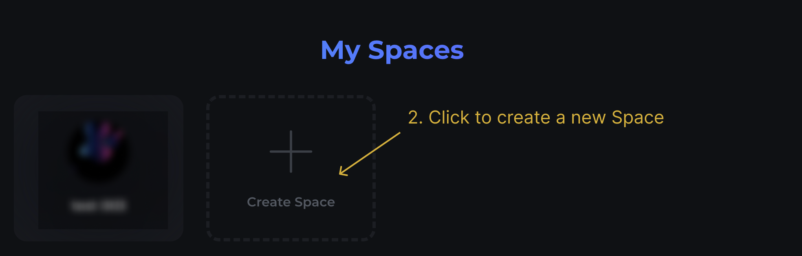
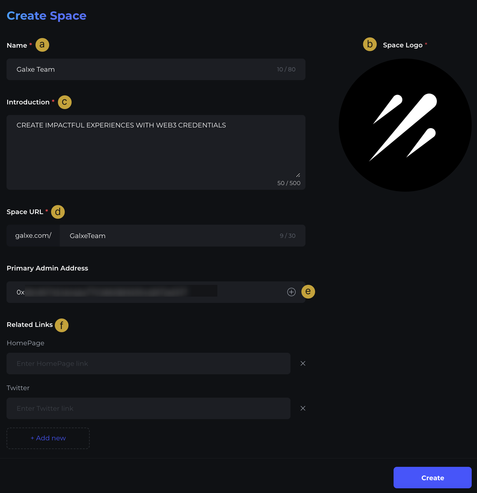

# Step 1 - Create a Space

## Create your dedicated space on Galxe

1. For partners looking to create and edit a new space on the Galxe dashboard, look no further! A space is where all of your growth campaigns will live on our site. To create a space, hover over your Galxe profile icon at the top right then click "My Spaces" 

2. Click "Create Space" to proceed

3. Fill up the space information accordingly (*Introduction refers to Protocol/Project Description) 

a. Fill up the name of your project

b. Upload a 1:1 aspect ratio logo (jpg or png format)

c. Fill up a brief introduction of your project

d. URL for your Space on Galxe

e. Fill up the primary admin wallet address for the Space and click “+” to add (Primary Admin of Protocol/Project)

f. Input official links to your projects

g. Click "Create"

h. Confirm to create space by clicking "Sign" on the signature request

## Update Space Info

* After the space is created, you can check all the information in their accessible spaces.
* All information can be updated by clicking the respective feature (Name, Logo, etc.).
* The primary admin can add additional admins to the space. The additional admin addresses will have the same access as the primary admin (Including all-access such as update/delete/retrieve/create).

## Add / Remove Admin

1. Input the additional admin wallet address and select "+"
2. Remove existing admin wallet address by selecting "x"

