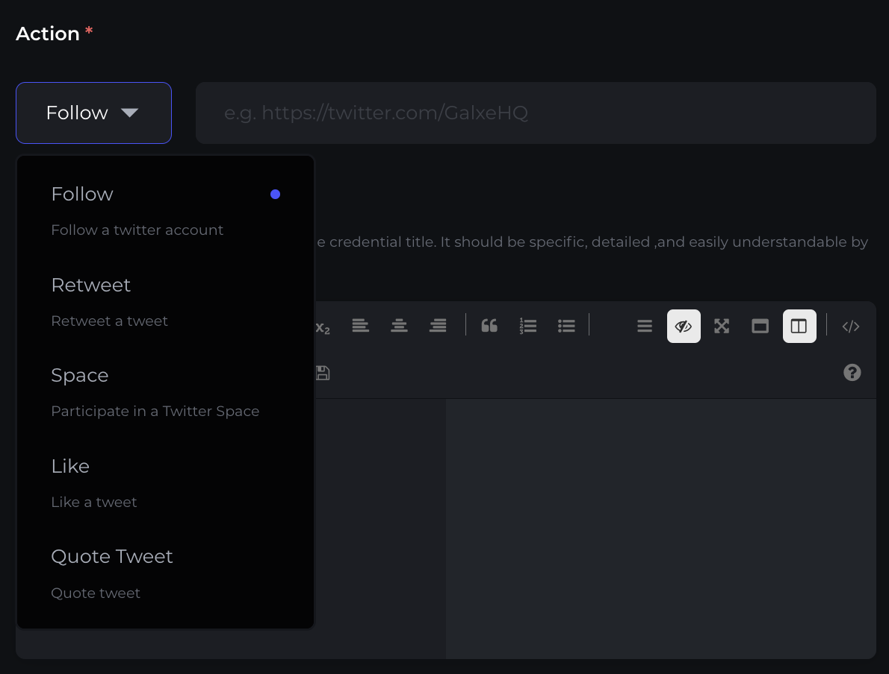
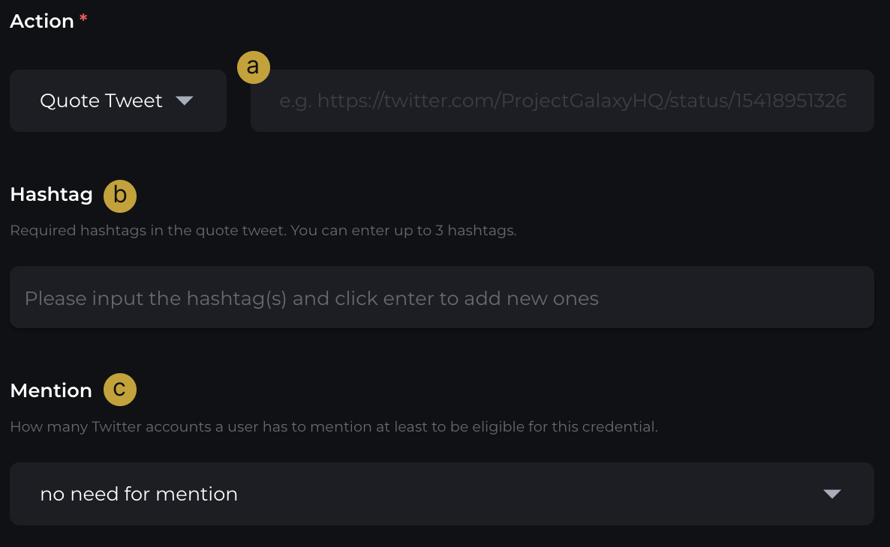
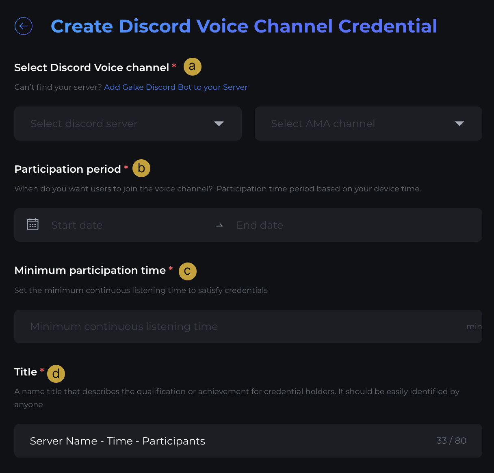
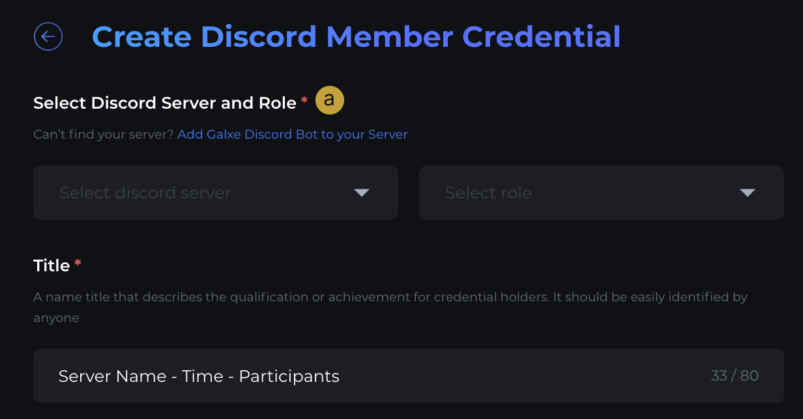
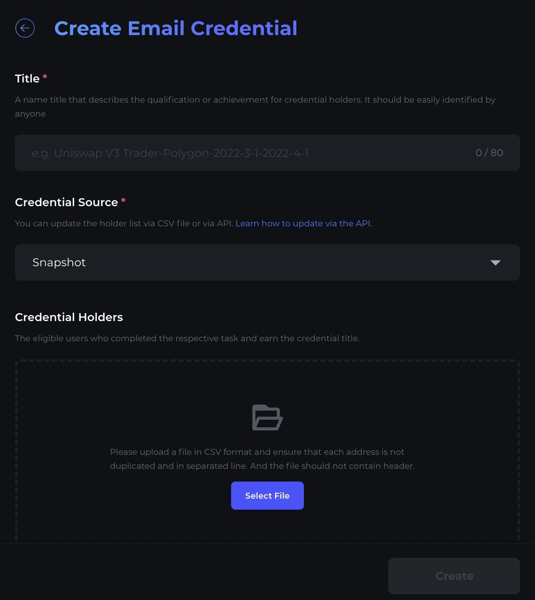
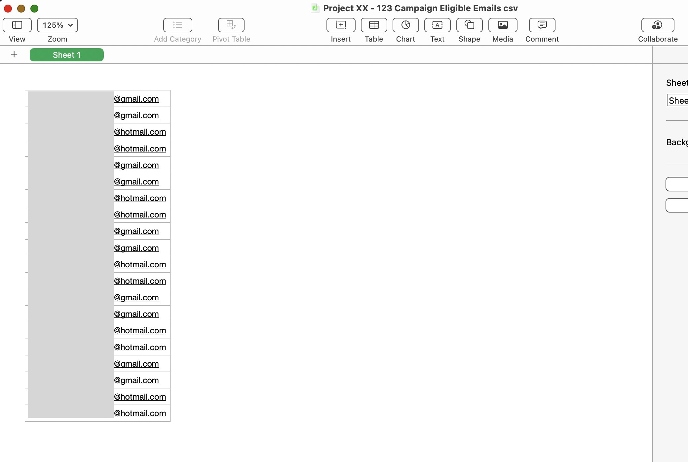
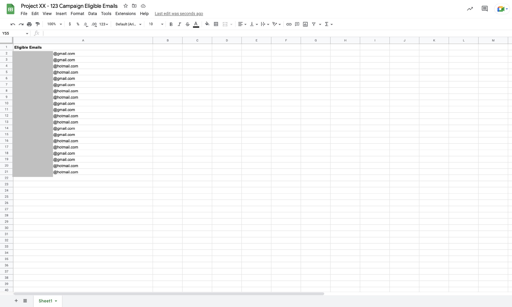
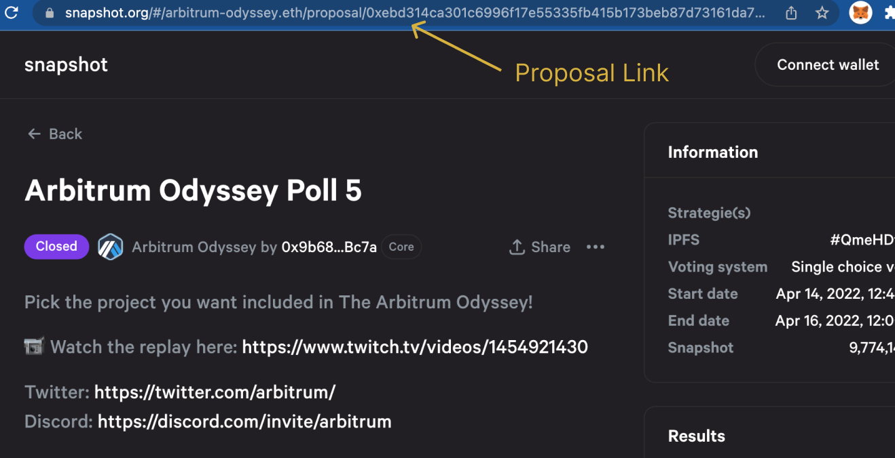
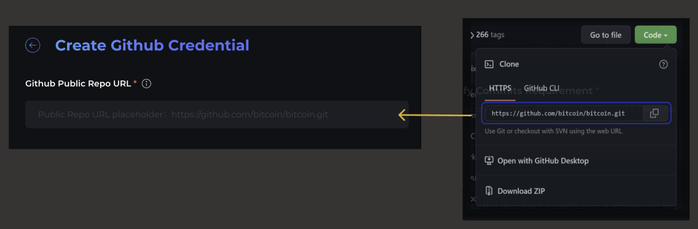
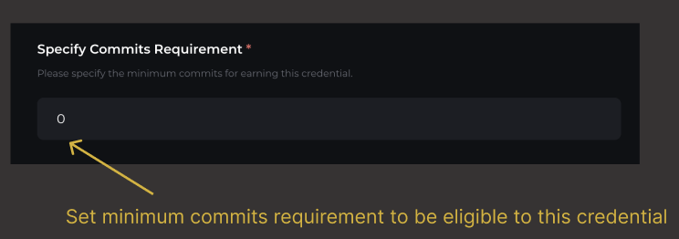

# Step 2 - Curate Credentials

## Supported Credential types

Currently we support curating credentials including:

* EVM Address/ Solana Address
* Email
* Discord 
* Twitter
* Snapshot 
* Github

## EVM Address Credential

> The EVM Credential is designed to provide proof that a user has completed a task on a perspective EVM Chain. EVM Chain examples: Ethereum, BNB CHAIN, Polygon, Arbitrum, Optimism, Moonbeam etc. 

To create this credential, go to your profile avatar (top right), click onto Curated Credentials and select EVM Address

💡 The user can see and select all credentials from any user while creating the space campaign, but on the “Curated Credentials” page, the user can only see and edit their own created credential list.

### Credential Source

Under Credential Source, select the relevant type:

#### 1. Snapshot

The user can update the holder list via **CSV file** (or via API. [Learn how to update via the API](https://docs.galxe.com/developer/guide/api-cred-items-update))

* Step 1: The user can easily upload addresses in batches at once with the following file requirements:

  * The file needs to be CSV format (Without Comma)
  * Each address must not be duplicated
  * The file should not contain headers
* Step 2: Please find here a screenshot example of a CSV template

* Step 3: Upload the CSV file (Duplicated addresses will be removed)

#### 2. Subgraph

> Applies to on-chain credentials. The holder list will be updated from [thegraph.com](https://thegraph.com/en/) through the endpoint/query/expression information specified.

It requires 3 fields to be filled: **Queries (HTTP)**, **Query** and **Expression**

##### Queries (HTTP) Endpoint

##### **Query**

Use this query to check whether an address is eligible for the credential or not

##### **Expression**

This section should include the JavaScript Code used to convert the above Query result into a 0/1 output with 0 as the non-eligible queried address and 1 as the eligible credential

More examples for subgraph source credential, please refer to: 

<https://galaxy.eco/credential/509>

<https://galaxy.eco/credential/47>

<https://galaxy.eco/credential/483>

<https://galaxy.eco/credential/173672263464951808>

##### 3. Google sheet

* Step 1: Sort out all the eligible addresses to a Google Sheet File
* Step 2: Please find here a screenshot example below of a Google Sheet Template
* Step 3: Add [spreadsheet@galxe.com](mailto:spreadsheet@galxe.com) as a viewer first
* Step 4: Paste the Google Sheet URL (duplicated addresses will be removed)

Compulsory items to include, which cannot be edited once created (circled in green): 

* Sheet Title | Eg. Project XX - 123 Campaign
* Header | Eg. Eligible BEP-20 Wallet Addresses (EVM) 
* The list of Wallet Addresses | “0x…” (One wallet address per separate row)
* Tab Title | Eg. Sheet1

💡 The Google Sheet URL (link) cannot be altered once it has been synced to create a credential

## Twitter Credentials

The Twitter option is chosen for Twitter-related actions. Such actions include: Follow, Retweet, Space, Like, and Quote Tweets.

### Twitter Follow Action

The Twitter Follow action requires users to follow a Twitter account. 

*E.g.*[https://twitter.com/Galxe](https://twitter.com/GalxeHQ*)

💡 It would be best to create the Twitter Follow Credential about 1 to 3 days before the campaign release. After the setup, the sync rate will be 10k data per hour.

💡Please input the full link of the Twitter account. We don’t support detecting Twitter handle at the moment

### Twitter Retweet and Like Actions

The Twitter Retweet and Like action requires users to retweet and like a tweet respectively.

* Projects need to create the Twitter posts first, and include the URL to the credential

*E.g.*<https://galxe.com/smoothie/campaign/GCsozUt9UW>

### Twitter Space Action

The Twitter space action requires users to participate in a Twitter Space.

*E.g.*<https://galxe.com/credential/185358493101498368>

💡 However, there are some *limitations* for the **Twitter space** credential. And projects are required to inform participants in advance.

* Only participants that **log in** Twitter accounts can be captured
* Only participants that attend the Twitter space using **mobile** will be captured.
* Host and speakers can not be captured.
* Due to Twitter restrictions, we can only issue this credential to at most **1000** participants. The longer they listen, the more likely they can get the credential. 

### Twitter Quote Tweet Action

The Twitter Quote Tweet action requires users to quote a tweet. 

*E.g.* *<https://twitter.com/GalxeHQ/status/1575184078843699200?cxt=HHwWgICjtd7kltwrAAAA>*

a. Action: Input twitter post link

b. Hashtags: Required in the quote tweet. You may enter up to 3 hashtags

c. Mention: Select the minimum number of Twitter accounts a user has to mention to be eligible for the credential

## Discord Credentials

> The Discord option is chosen for Discord-related formats. There are **two types**: 1) Discord Voice Channel and 2) Discord Member

### 1. Discord Voice Channel (a.k.a AMA)

> **About Discord Voice Channel**
>
> This Discord Voice Channel tracks Discord IDs instead of wallet addresses automatically. The credential will be updated immediately after participants leave the AMA channel .
>
> E.g. participants tuning to the AMA for 15 mins consecutively will be able\
> to claim an OAT or NFT

You will first need to add [Galxe Discord Bot](https://discord.com/oauth2/authorize?client_id=947863296789323776&scope=bot&permissions=2148598848) to your Server.

Thereafter, fill up the following details:

a. Select your **Discord Server** and **AMA Channel**

b. **Participation Period:** Set the participation time period that you want users to join your voice channel. Select the period based on your device time.

c. **Minimum Participation Time:** Set the minimum continuous listening time to satisfy credentials

d. **Title, Description** and **Reference Link** as per details

### 2. Discord Members

You will first need to add [Galxe Discord Bot](https://discord.com/oauth2/authorize?client_id=947863296789323776&scope=bot&permissions=2148598848) to your Server.

Thereafter,

1. select your Discord Server and targeted Role. Fill up the Title, Description and Reference Link as per details.

💡 The Specific Discord Member Credential role cannot be tracked automatically. In order for users to claim and track the specific **Discord member** role, users have to:

* Bind their DiscordID to their GalxeID 
* Visit the respective campaign or credential page, and click refresh

## Email credential

> 💡Wondering how to create an Email Credential for your community but don’t know where to start? This Credential is designed to credential a user’s email for specific tasks. Create this credential by…

1. Input **Title, Description** and **Reference Link**
2. **Credential Source:** *via Snapshot or Google Sheet*

### Credential Source

Under **Credential Source**, select the relevant type.

#### 1. Snapshot

* Step 1: The user can easily upload addresses in batches at once with the following file requirements:

  * The file needs to be CSV format (Without Comma)
  * Each address must not be duplicated
  * The file should not contain headers
* Step 2: Please find here a screenshot example of a CSV template

  
* Step 3: Upload the CSV file (Duplicated addresses will be removed)

#### 2. Google sheet

* Step 1: Sort out all the eligible addresses to a Google Sheet File
* Step 2: Please find here a screenshot example below of a Google Sheet Template

  
* Step 3: Add [spreadsheet@galxe.com](mailto:spreadsheet@galxe.com) as a viewer first
* Step 4: Paste the Google Sheet URL (duplicated addresses will be removed)

💡 The Google Sheet URL (link) cannot be altered once it has been synced to create a credential

## Snapshot Credential

> 💡 **What is Snapshot Credential?**
>
> Snapshot credential records wallet addresses that have voted a specific proposal on [Snapshot.org](http://Snapshot.org)

Wondering how to create a Snapshot Credential for your community but don’t know where to start? To create this credential:

**Step 1** - Find the proposal link

**Step 2** - Copy and paste the Snapshot proposal link to proceed

**Step 3** - Fill up the Title and Description

1. **Title, Description** and **Reference Link** as per details

## Github contributor credential

> 💡 **What is a Github credential?**
>
> Github credentials are used to identify contributions based on commits on Github public repo.

**Step 1 -** Copy and paste Github Public Repo URL

**Step 2 -** Specify the minimum commits requirement

**Step 3 -** Fill up Title and Description

> **E.g.**
>
> Title: Galxe Github contributor
>
> Description: Users who have contributed more than 20 commits on Galxe’s Github repo.