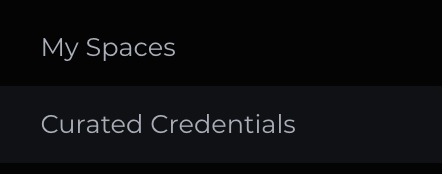
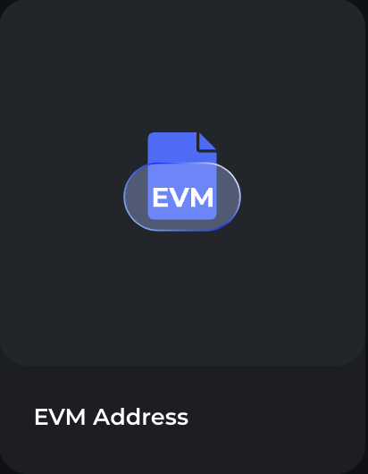
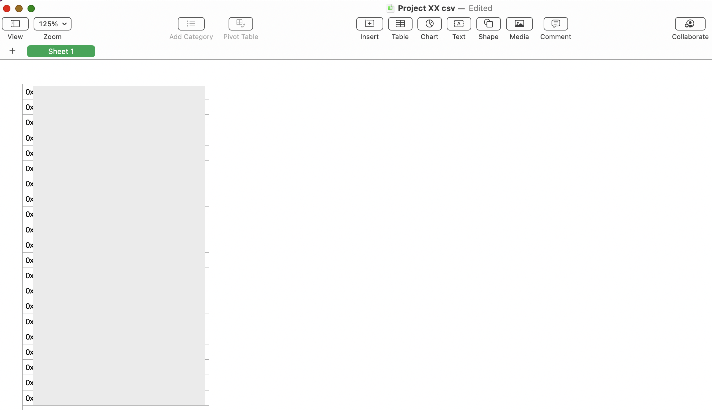
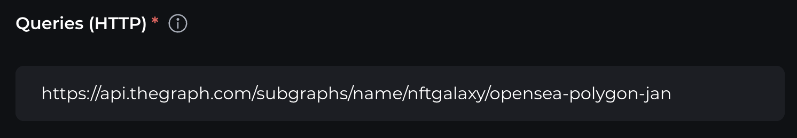
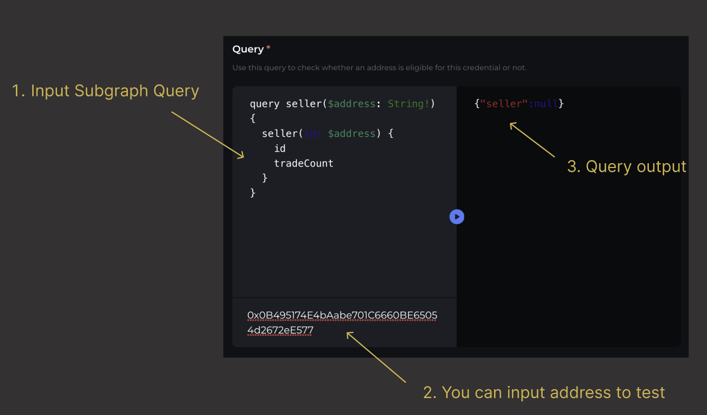
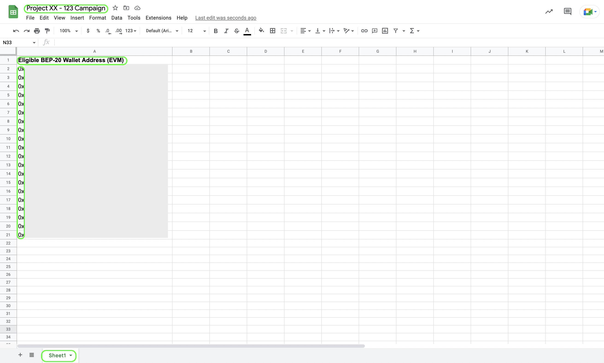
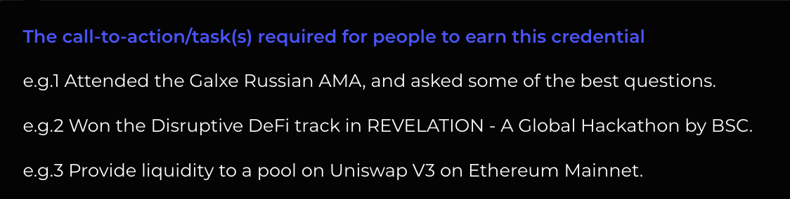

# Step 2 - Curate Credentials

## Supported Credential types

Currently we support curating credentials including:

* EVM Address/ Solana Address
* Email
* Discord 
* Twitter
* Snapshot 
* Github

### EVM Address Credential

> The EVM Credential is designed to provide proof that a user has completed a task on a perspective EVM Chain. EVM Chain examples: Ethereum, BNB CHAIN, Polygon, Arbitrum, Optimism, Moonbeam etc. 
>
>

To create this credential, go to your profile avatar (top right), click onto Curated Credentials and select EVM Address

\*The user can see and select all credentials from any user while creating the space campaign, but on the “Curated Credentials” page, the user can only see and edit their own created credential list.

### Credential Source

Under Credential Source, select the relevant type for your project.

#### 1. Snapshot

The user can update the holder list via **CSV file** (or via API. [Learn how to update via the API](https://docs.galxe.com/developer/guide/api-cred-items-update/) - <https://docs.galxe.com/developer/guide/api-cred-items-update/>)

* Step 1: The user can easily upload addresses in batches at once with the following file requirements:

  * The file needs to be CSV format (Without Comma)
  * Each address must not be duplicated
  * The file should not contain headers
* Step 2: Please find here a screenshot example of a CSV template

* Step 3: Upload the CSV file (Duplicated addresses will be removed)

#### 2. Subgraph

> Applies to on-chain credentials. The holder list will be updated from [thegraph.com](https://thegraph.com/en/) through the endpoint/query/expression information specified.

It requires 3 fields to be filled: **Queries (HTTP)**, **Query** and **Expression**

##### Queries (HTTP) Endpoint

##### **Query**

Use this query to check whether an address is eligible for the credential or not

##### **Expression**

This section should include the JavaScript Code used to convert the above Query result into a 0/1 output with 0 as the non-eligible queried address and 1 as the eligible credential

More examples for subgraph source, please refer to:

<https://galaxy.eco/credential/509>

<https://galaxy.eco/credential/47>

<https://galaxy.eco/credential/483>

<https://galaxy.eco/credential/173672263464951808>

##### 3. Google sheet

* Step 1: Sort out all the eligible addresses to a Google Sheet File

* Step 2: Please find here a screenshot example below of a Google Sheet Template
* Step 3: Add [spreadsheet@galxe.com](mailto:spreadsheet@galxe.com) as a viewer first
* Step 4: Paste the Google Sheet URL (duplicated addresses will be removed)

Compulsory items to include, which cannot be edited once created (circled in green): 

*  Sheet Title | Eg. Project XX - 123 Campaign
* Header | Eg. Eligible BEP-20 Wallet Addresses (EVM) 
* The list of Wallet Addresses | “0x…” (One wallet address per separate row)
* Tab Title | Eg. Sheet1

Note: The Google Sheet URL (link) cannot be altered once it has been synced to create a credential

## Description

A short write-up of the required tasks in order to earn the credential title. It should be specific, detailed and easily understandable.

## Reference Link

You may include a direct link to your campaign page, social media pages etc.