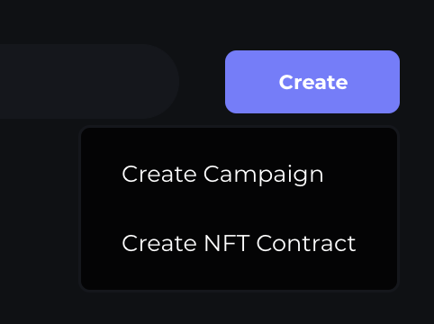
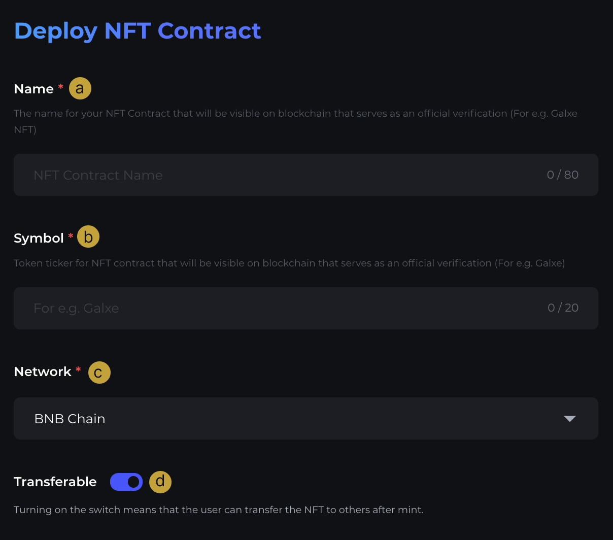
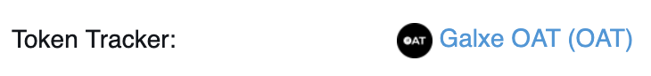

# Step 3 - Deploy an NFT Contract

## About NFT Contract on Galxe Dashboard

* Users can deploy and view NFT contracts in their respective space on Galxe Dashboard.
* Galxe supported network on dashboard: BNB CHAIN, Ethereum, Polygon, Fantom, Arbitrum, Avalanche, Moonbeam, Optimism, IoTex
* The NFT Contract on Galxe Dashboard is a general NFT ERC 721 contract. (For ERC 1155, Non-transferrable, Fee/Capped module or any specific requirement, please contact Galxe for assistance.)

## Deploy a new NFT contract

1. Click "Create NFT Contract"

2. Fill up Contract Info

a. Fill up the name of an NFT Contract (For e.g. Galxe NFT)

b. Input symbol(Token Tracker) for the NFT contract. (e.g. Galxe OAT)

c. Select the desired Network (Chain) to deploy your NFT contract

d. Activate Transferrable if you’d like the NFTs created on this contract to be transferrable/tradable

e. Click "Deploy"

f. Confirm to deploy the contract by clicking "Sign" on the signature request

g. Proceed to pay for the transaction to deploy a contract successfully
