# Step 4 - Kickstart a Campaign

## About campaigns on Galxe

* Under the **Campaigns**, admins can view campaigns and previous drafts and edit/update the campaign information anytime by clicking “…” on each campaign card.

  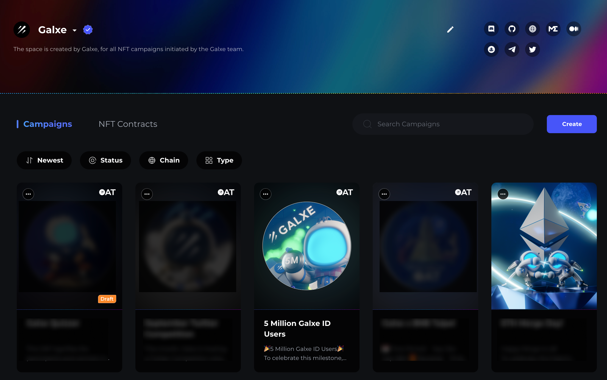
* Currently, the galxe dashboard supports four types of campaigns creation:

  * OAT Campaign: Galxe On-Chain Achievement Token Campaign
  * Drop Campaign - Single NFT campaign
  * Mystery Box - Mystery NFTs campaign based on probability or a capped pool of NFTs
  * Parent Campaign - Multiple NFTs campaign in 1 master campaign
* Galxe support multiple modules to gamify your NFT campaigns (Please contact Galxe for assistance):

  * NFT Forging
  * NFT Launchpad (Initial NFT Offering)
  * Dynamic Loyalty Points NFT
  * Collab Land: Gated Chat Access
  * MetaFactory: Merch Access
  * Snapshot: Voting w/ NFTs
  * Perk Center: A benefit center for your community
  * Gasless Minting (Matic network only)

  💡Note: Once a campaign has been released, the selected NFT Contract used for the specific campaign is irreversible 

## OAT Campaign Guide

> 💡The Galxe OAT is designed to be a gasless NFT solution to engage/reward users for completing various on or off-chain actions. 
>
> On a side-note, the OAT can be on Polygon or BSC!

### **Video guide**  

<iframe width="560" height="315" src="https://www.youtube.com/embed/NIly2ykBbkk" title="YouTube video player" frameborder="0" allow="accelerometer; autoplay; clipboard-write; encrypted-media; gyroscope; picture-in-picture" allowfullscreen></iframe>

### **To create this campaign...**

Click “Create Campaign” and select “Galxe OAT”

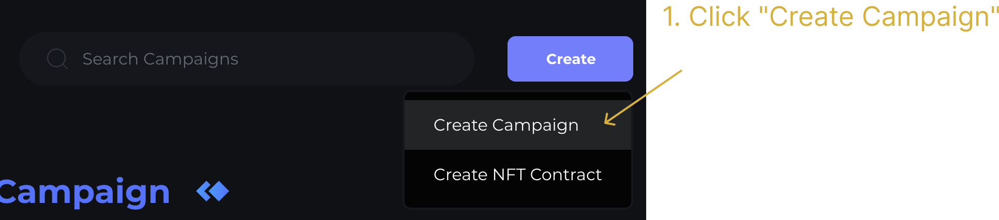

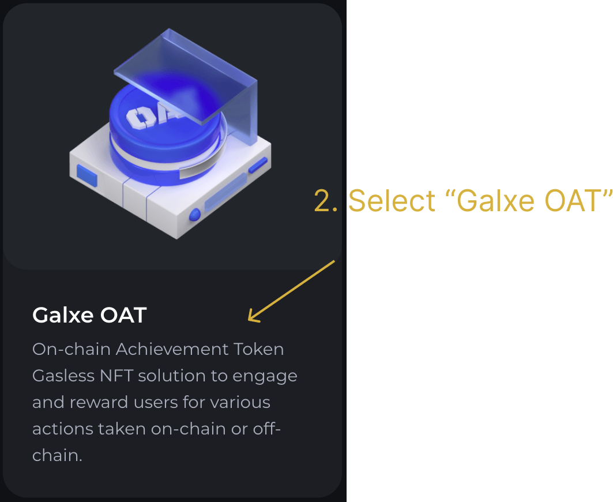

### Fill up the “**Campaign Details” Component**

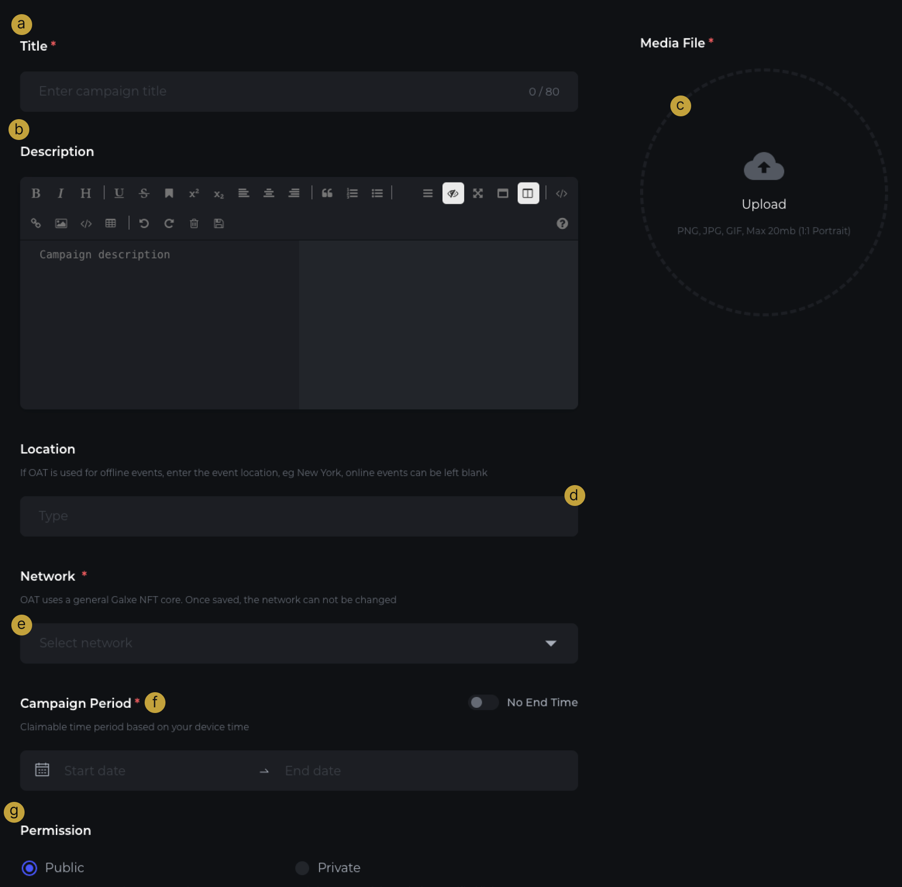

a. Campaign Title (should be no more than 50 Characters)

b. Campaign Description

c. OAT Media : PNG, JPG, GIF Max 20mb (1:1 circle) - The image you upload must be fully loaded to continue to the next page

d. Location: If OAT is used for offline events, input the event location

e. Network: OAT is currently available on Polygon Network and BNB Chain

f. Campaign Period (NFT Claim period on Galxe)

* Select the NFT start and end claim time (as per your device time zone)
* Activate the "No End Time" feature if the claim period has no end time

g. Permission

* Public: campaign will be visible under the SpacePublic: campaign will be visible under the Campaign and Space page
* Private: Campaign will be hidden from the Space page, and only accessible through the specified link

### Fill up the “**Who is Eligible” Component**

a. Toggle on the "**Open to All**" feature if the campaign is available for all users to claim

b. Select existing credential ID from the list (search function activated for all credentials)

c. Input the Entry (claim count: number of times an address/email is eligible to claim)

d. Click "**Create New**" to create a new credential not available under the Credential List

e. Click "**+ Add new**" for a different Entry and Credential

f. The "**AND / OR**" feature can be activated when selecting more than **one** credentials:

* **AND:** All selected credentials in one row have to be fulfilled for users to be eligible for a selected number of entries
* **OR:** Selected credentials in separate rows can be fulfilled for users to be eligible for various entries

Click "Save" to save the draft or click "Release" to release the campaign on Galxe immediately. All components must be completed with the tick emoji (✅) indicated, to activate the "Save"/"Release" feature.

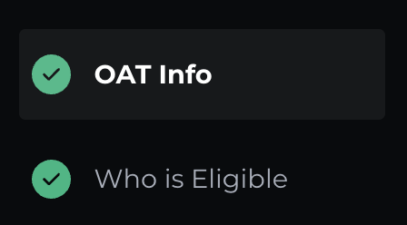

Confirm to **save** or **release** the Campaign by clicking "Sign" on the signature request.

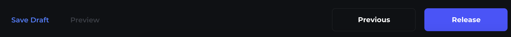

## Drop Campaign Guide

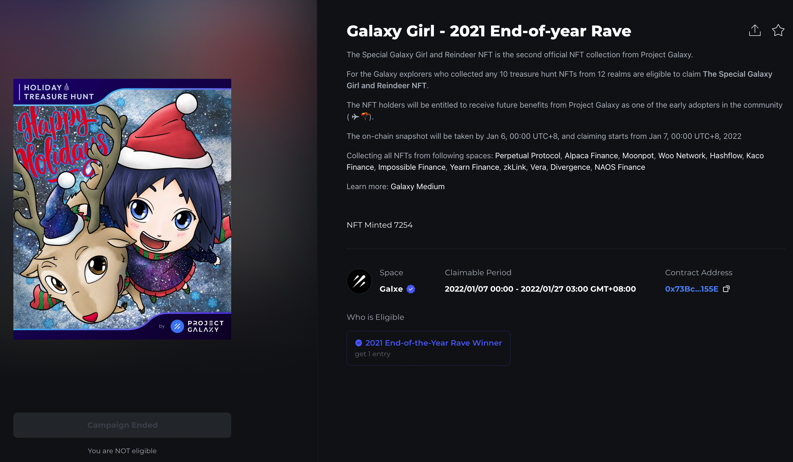

Please refer to: [Galaxy Girl - 2021 End-of-year Rave by Galxe](https://galxe.com/Galxe/campaign/GCts8UUAPJ)

> 💡The Drop Campaign is designed to distribute NFTs with a single design or multiple designs as rewards for eligible users.

### **Video guide** 

<iframe width="560" height="315" src="https://www.youtube.com/embed/4nAQ8xwADLw" title="YouTube video player" frameborder="0" allow="accelerometer; autoplay; clipboard-write; encrypted-media; gyroscope; picture-in-picture" allowfullscreen></iframe>

### **To create this campaign...**

Click “Create Campaign” and select “Drop Campaign”

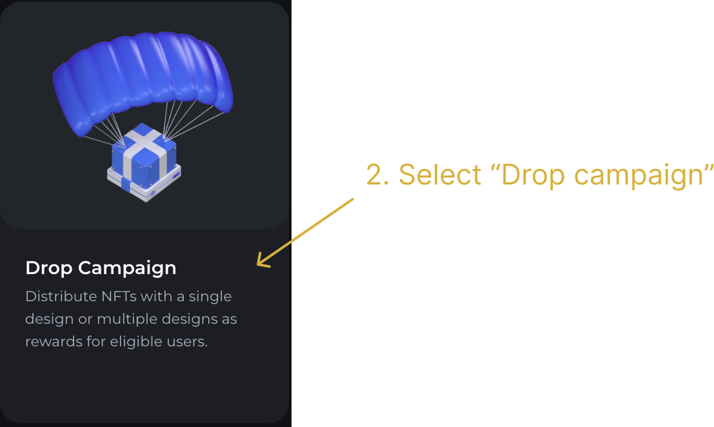

### Fill up “**Campaign Info” Component**

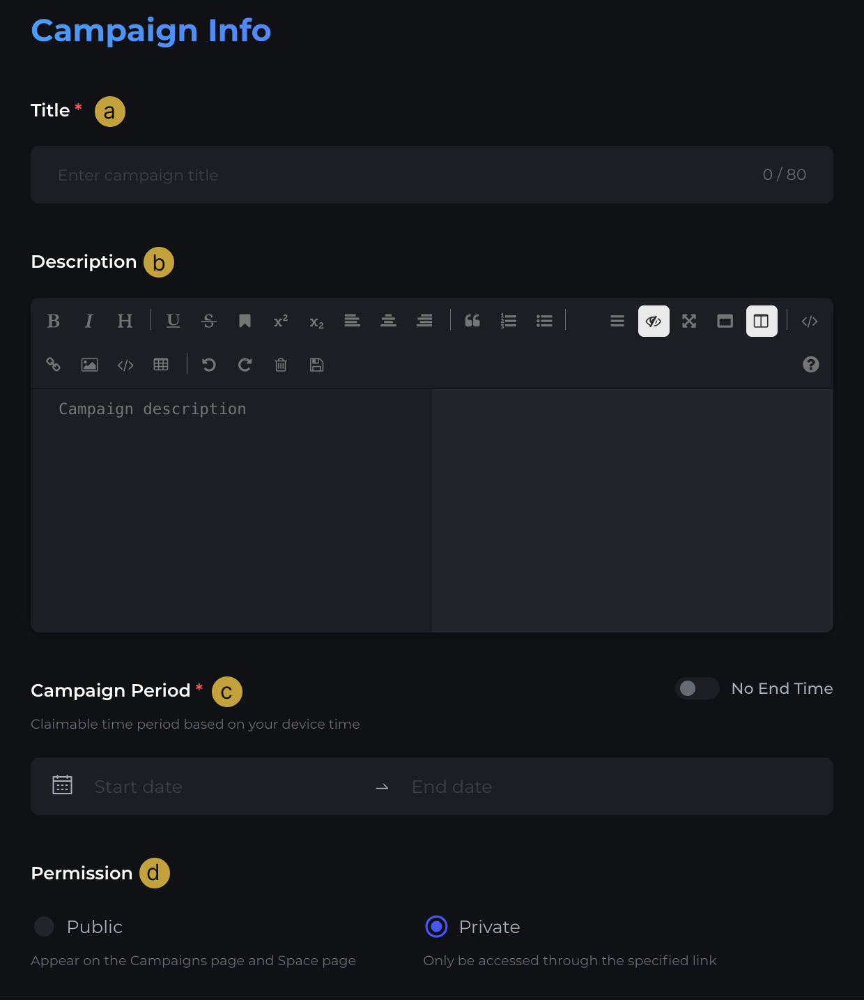

a. Campaign Title (should be under 80 characters)

b. Campaign Description

c. Campaign Period (NFT Claim Period on Galxe)

* Select the NFT start and end claim time (as per your device time zone)
* Toggle on the "No End Time" feature if the claim period has no end time

d. Permission

* Public: The campaign will be visible under the Campaign and Space page
* Private: The campaign will be hidden from the Space page, and only accessible through the specified link

### Fill up the “NFT Info” Component

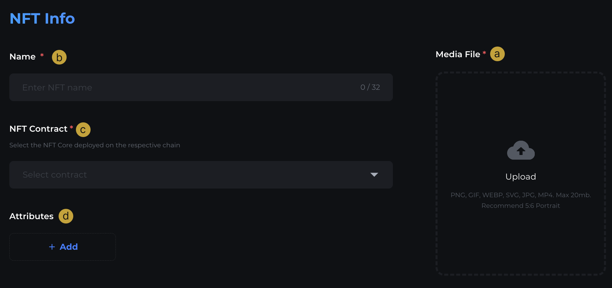

a. NFT Media File Specs

* Static: PNG, WEBP, SVG, JPG
* Animated: GIF, MP4
* Less than 20mb
* 5:6 aspect ratio recommended
* The image you upload must be fully loaded to continue to the next page

b. Name: NFT name should be less than 32 characters, special characters are not allowed (Eg. Shadowy Coder NFT)

c. NFT contract: Select the respective NFT contract (See “[How to create a NFT contract](https://docs.galxe.com/guide/dashboard-tutorial/step-3-deploy-nft-contract) ”)

d. Attributes: If required, toggle the "+ Add" and add in the "Name" and "Value"

### Fill up the “Who is eligible” Component

a. Toggle on the "**Open to All**" feature if the campaign is available for all users to claim 

b. Select existing credential ID from the list (search function activated for all credentials)

c. Input the Entry (claim count: number of times an address/email is eligible to claim)

d. Click "**Create New**" to create a new credential not available under the Credential List

e. Click "**+ Add new**" for a different Entry and Credential

f. The "**AND / OR**" feature can be activated when selecting more than **one** credentials:

* **AND:** All selected credentials in one row have to be fulfilled for users to be eligible for a select number of entries
* **OR:** Selected credentials in separate rows have to be fulfilled for users to be eligible for a select number of entries

Click "Save" to save the draft or click "Release" to release the campaign on Galxe immediately. All components must be completed with the tick emoji (✅) indicated, to activate the "Save"/"Release" feature.

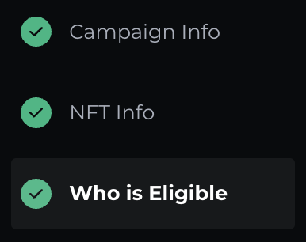

Confirm to save or release the Campaign by clicking "Sign" on the signature request

## Mystery Campaign Guide

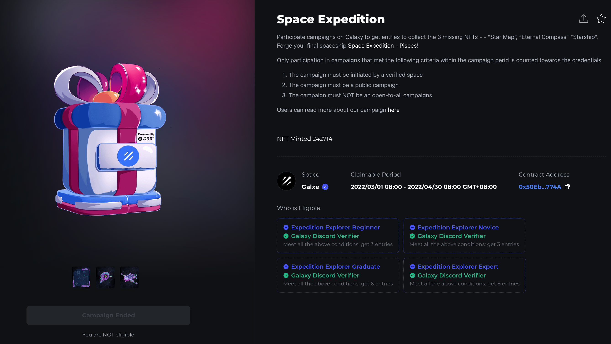

Please refer to: Space Expedition by Galxe

> 💡The Mystery Box is designed to distribute NFTs based on weighted rarities in each box.

### **Video guide** 

<iframe width="560" height="315" src="https://www.youtube.com/embed/6JcGJ-lzwr0" title="YouTube video player" frameborder="0" allow="accelerometer; autoplay; clipboard-write; encrypted-media; gyroscope; picture-in-picture" allowfullscreen></iframe>

### **To create this campaign...**

Click “Create Campaign” and select “Mystery Box”

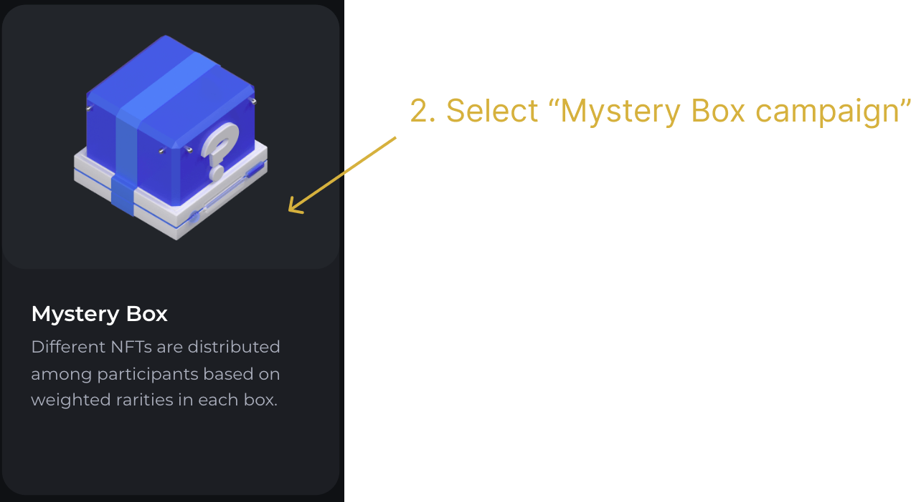

### Fill up the “**Campaign Info” Component**

a. Campaign Title (should be under 80 Characters)

b. Campaign Description

c. Media File for Mystery Box campaign cover image

* Static: PNG, WEBP, SVG, JPG
* Animated: GIF, MP4
* Less than 20mb
* 5:6 aspect ratio recommended
* The image you upload must be fully loaded to continue to the next page

d. Campaign Period (The NFT Claim period on Galxe)

* Select the NFT start and end claim time (as per your device time zone)
* Activate the "No End Time" feature if the claim period has no end time

e. Permission:

* Public: campaign will be visible under the SpacePublic: campaign will be visible under the Campaign and Space page
* Private: Campaign will be hidden from the Space page, and only accessible through the specified link

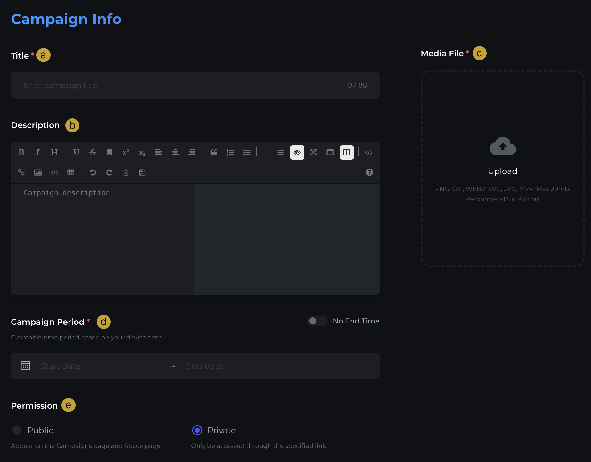

### Fill up the “Mystery NFT Info” Component

a. NFT Contract: Select the respective NFT contract (See “[How to create a NFT contract](https://docs.galxe.com/guide/dashboard-tutorial/step-3-deploy-nft-contract) ”)

b. Click “+ Add New Mystery NFT” to insert multiple NFTs in the Mystery Box

c. Name: NFT name should be less than 32 characters, special characters are not allowed (e.g. Shadowy Coder NFT)

d. Mystery NFT File Specs

* Static: PNG, WEBP, SVG, JPG
* Animated: GIF, MP4
* Less than 20mb
* 5:6 aspect ratio recommended

e. Attributes: If needed, toggle on the "+ Add" and add the "Name" and "Value"

f. Weight: set weighted rarity for each NFT in each box

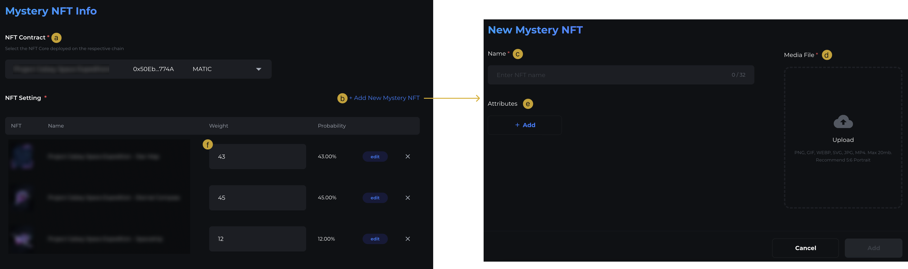

### Fill up the “Who is eligible” Component

a. Toggle on the "Open to All" feature if the campaign is available for all users to claim **OR**

b. Select existing credential ID from the list (search function activated for all credentials)

c. Input the Entry (claim count: number of times an address/email is eligible to claim)

d. Click "Create New" to create a new credential not available under the Credential List

e. Click "+ Add new" for a different Entry and Credential

f. The "AND / OR" feature can be activated when selecting more than **one** credential:

* AND: All selected credentials in one row have to be fulfilled for users to be eligible for a select number of entries
* OR: Selected credentials in separate rows have to be fulfilled for users to be eligible for a select number of entries

Click "Save" to save the draft or click "Release" to release the campaign on Galxe immediately. All components must be completed with the tick emoji (✅) indicated, to activate the "Save"/"Release" feature.

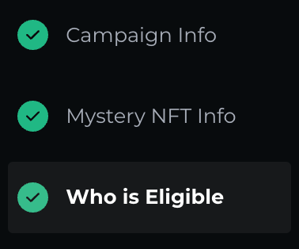

Confirm to save or release the Campaign by clicking "Sign" on the signature request.

## Parent Campaign Guide

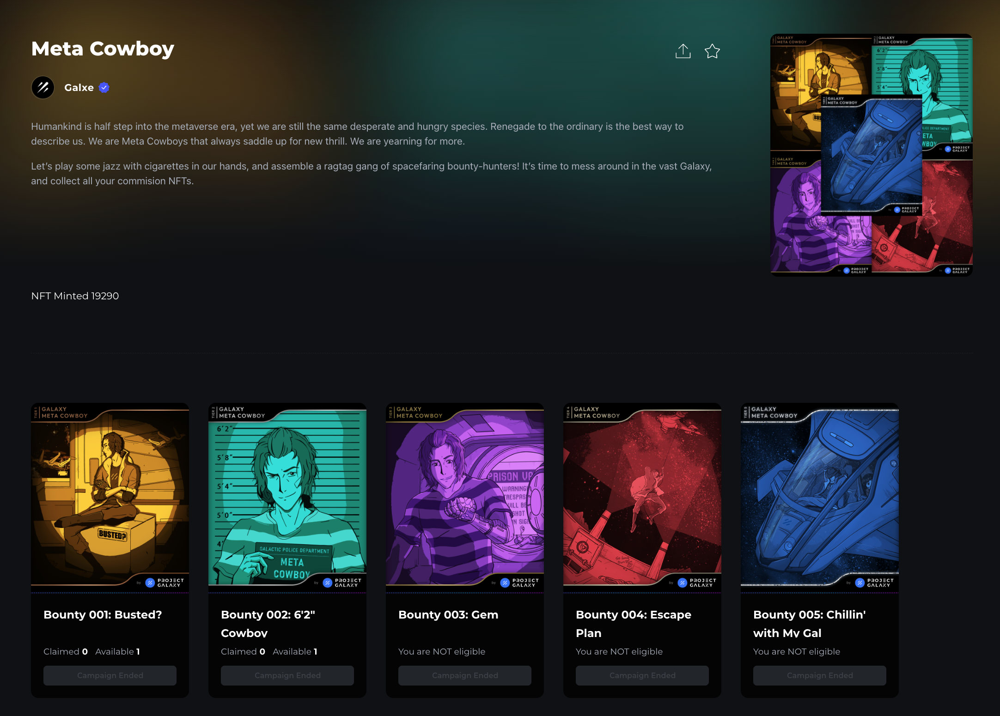

Please refer to: [Meta Cowboy by Galxe](https://galxe.com/Galxe/campaign/GCMDXUUhhb)

> 💡 The Parent Campaign is designed to display multiple NFT drop campaigns within one bigger umbrella campaign. 

### **Video Guide**

<iframe width="560" height="315" src="https://www.youtube.com/embed/ZZ9yNc4_eVU" title="YouTube video player" frameborder="0" allow="accelerometer; autoplay; clipboard-write; encrypted-media; gyroscope; picture-in-picture" allowfullscreen></iframe>

### **To create this campaign...**

Click “Create Campaign” and select “Parent Campaign”

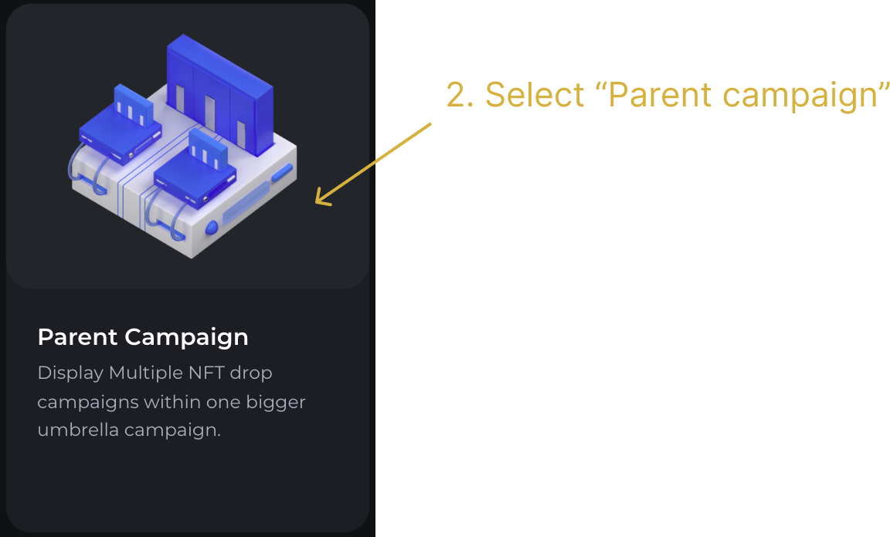

### Fill up the “**Campaign Info” Component**

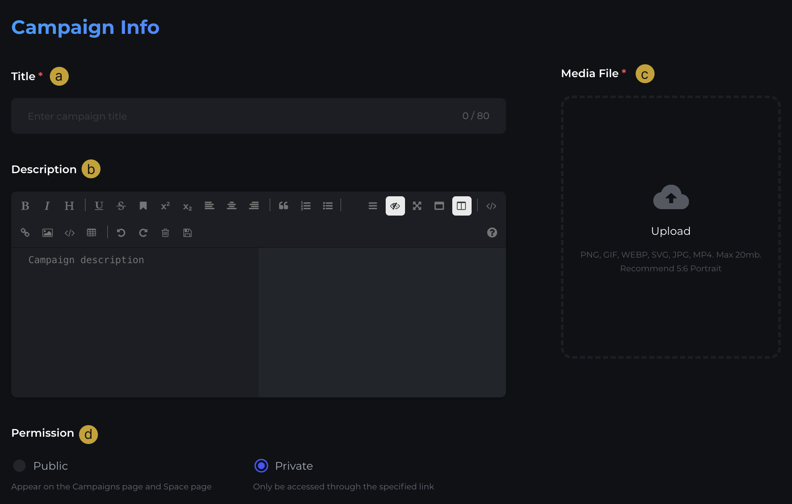

a. Campaign Title (should be under 80 Characters)

b. Campaign Description

c. Media File for Mystery Box campaign cover image

* Static: PNG, WEBP, SVG, JPG
* Animated: GIF, MP4
* Less than 20mb
* 5:6 aspect ratio recommended
* The image you upload must be fully loaded to continue to the next page

d. Permission:

* Public: campaign will be visible under the SpacePublic: campaign will be visible under the Campaign and Space page
* Private: Campaign will be hidden from the Space page, and only accessible through the specified link

### Fill up the “Child Campaigns” Component

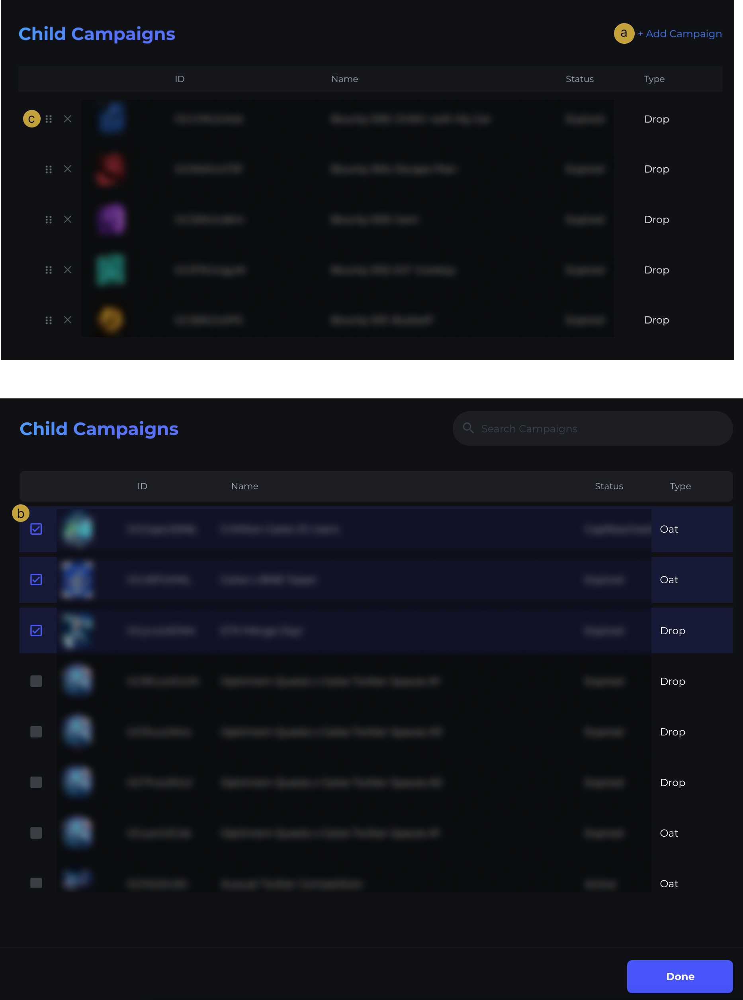

a. Click “+ Add Campaign” to add multiple campaigns under the Parent Campaign

b. Select Child Campaigns (note: only released child campaigns will be available on the list, draft campaigns cannot be added)

c. Drag to adjust the order of the child campaigns

### Fill up the “Who is eligible” Component

a. Toggle on the "Open to All" feature if the campaign is available for all users to claim **OR**

b. Select existing credential ID from the list (search function activated for all credentials)

c. Input the Entry (claim count: number of times an address/email is eligible to claim)

d. Click "Create New" to create a new credential not available under the Credential List

e. Click "+ Add new" for a different Entry and Credential

f. The "AND / OR" feature can be activated when selecting more than **one** credential:

* AND: All selected credentials in one row have to be fulfilled for users to be eligible for a select number of entries
* OR: Selected credentials in separate rows have to be fulfilled for users to be eligible for a select number of entries

Click "Save" to save the draft or click "Release" to release the campaign on Galxe immediately. All components must be completed with the tick emoji (✅) indicated, to activate the "Save"/"Release" feature.

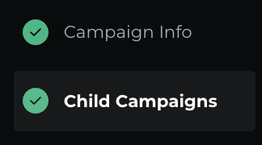

Save or release the Campaign by clicking "Sign" on the signature request.

## Congratulations!

If you stick with us through our Dashboard tutorials, congratulations! You have made your first step further to the Galxe filled with limitless creativity and excitement. Remember, this is just a start of your color journey. Sit tight and have fun!