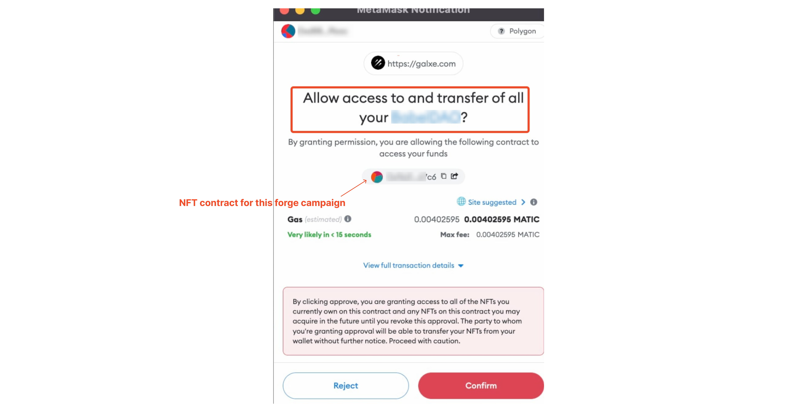

# Forge Campaign Permission FAQ

- - -

### Why would the wallet prompt user to “Allow access and transfer all”?

#### *Firstly, what is Forge Campaign?*

A forge campaign refers to user using multiple NFTs and having them forged (merged) into a single NFT. We can look at this as a level-up for NFTs.

**To put it simply:**

User who holds NFT A, B and C can forge these NFTS into a whole new NFT as below.

***So, why would Galxe need user to “allow access to and transfer all”?***

In order for forge to happen, NFTs (A, B and C) would have to be burned. Thus it would require Galxe be granted the access to have this done. 

Upon approval, access will be given to users for all NFTs owned by the user **on this NFT contract**. New NFTs **on this NFT contract** acquired in the future will also be granted approval until access is revoked.

(Note: Galxe only asks permission for "Approve ALL" when the user participates in Forge campaigns among all types of campaigns.)

By clicking “Approve”, the user will grant access to all of the NFTs that currently the user owned **on this NFT contract** and any NFTs **on this NFT contract** that may be acquired in the future until the user revokes this approval.

### How to revoke the permission granted to Galxe in Forge Campaigns?

Please refer to the following tutorials to revoke the permission:

1. [How to revoke smart contract allowances/token approvals](https://metamask.zendesk.com/hc/en-us/articles/4446106184731-How-to-revoke-smart-contract-allowances-token-approvals) with Metamask
2. [How can I revoke token approvals and permissions on Ethereum?](https://support.opensea.io/hc/en-us/articles/4416083190291-How-can-I-revoke-token-approvals-and-permissions-on-Ethereum-) with Etherscan